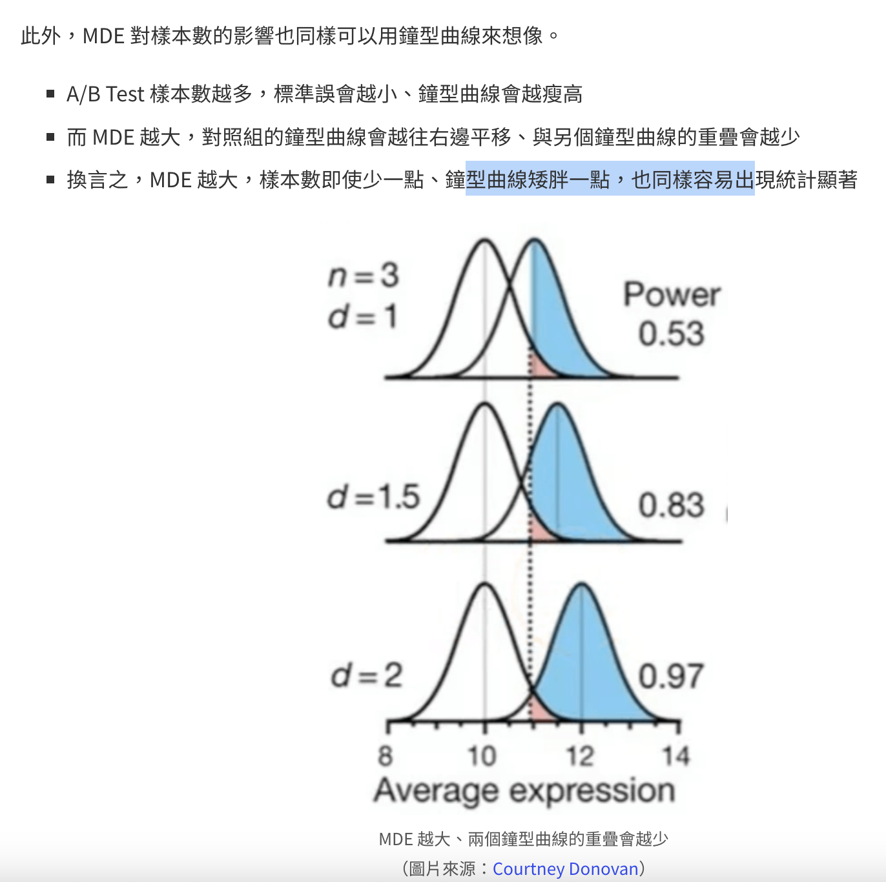
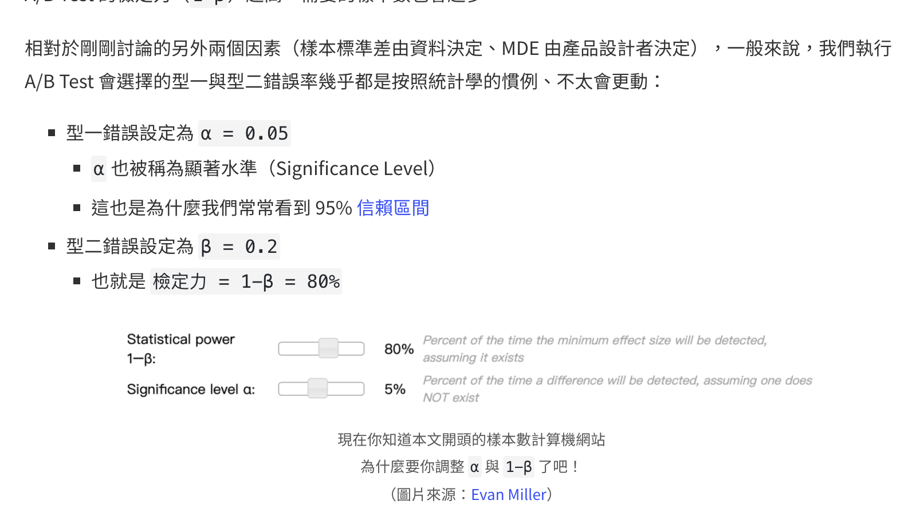
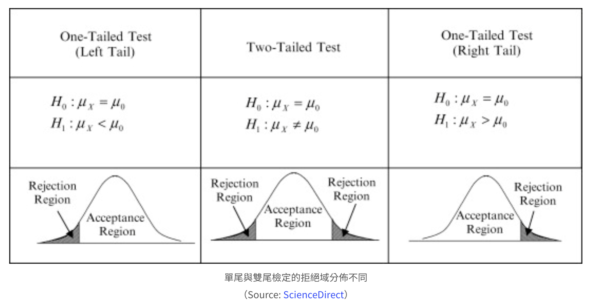
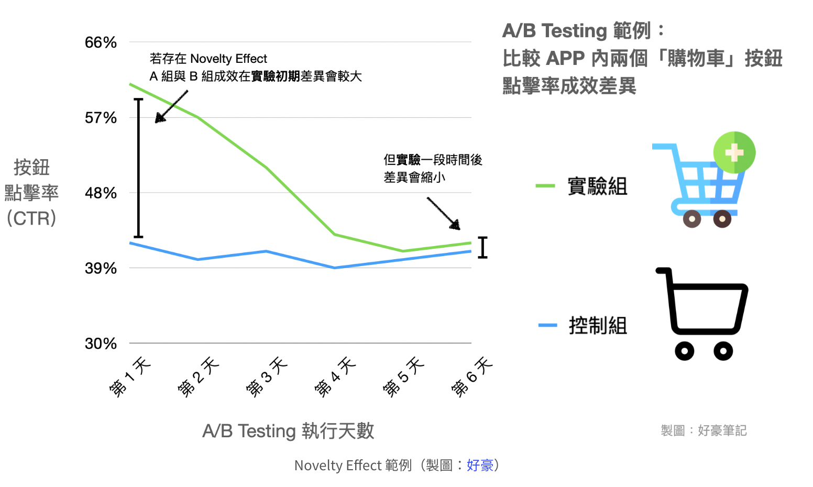

# A/B Test Interview
问题：配送公司Doordash打算开拓便利店配送，不知道是否推送通知合适

* 提出澄清问题，更好的理解业务目标
  * Interviewee：想要新用户的获取、增加该类别的转化率、增加订单总量或者订单总价格
  * Interviewer：提升该类别的转化率
* 零假设、备择假设和指标
  * 零假设（H0）：对转化率提升没有帮助
  * 主要指标：转化率，次要目标：人均单价（关注其他角度的变化），护栏指标：不想违反的指标，如卸载率
* 选择显著水平、功效、MDE，计算样本数及需持续的时间
  * 网络效应：对实验组的干预，也会对对照组产生影响，如配送员数量 **可采取的措施：基于地理位置随机、基于时间随机、基于网络结构随机**
  * 假设没有网络效应，实验单元就是用户（对照组和实验组），计算用户数量和实验天数
    * 需要的输入：基线转化率、预期提升效果MDE、显著性水平、功效
    * 用户数量：在线工具EvanMiller
    * 持续天数：假设用户数1w，DAU为1w，那持续天数就是2天，但是需要考虑时间因素（周期性、季节性、新奇效应、守旧效应、外部影响），所以一般要长些
* 分析结果
  * 检查随机化程度，AA Test，或者查看两组的一些基线指标，查看差异
  * 所有指标（主要、次要、护栏）显著性测试，Z检验或卡方检验

# 1、AB Test的基本流程
- 确定目标
  - xx的流量/转化率/客单价/留存率是多少？
- 确定对照组和实验组，计算样本数 http://www.evanmiller.org/ab-testing/sample-size.html
  - 原始转化率 (Baseline Conversion Rate)
  - 最小目标 (Minimum Detectable Effect, MDE)
  - 置信度 (Confident Level, 1-α)
  - 统计功效（Statistic Power, β）
- 设计实验
- 统计结果的检验

## 注意点
* 不要只关注1期转化率，也要关注链路的全部转化目标
* 注意进行假设检验 https://abtestguide.com/calc/

## 如果用户体量足够大，还需关注
* 实验群体是否同质，可进行AA实验
* 有些可能是长期行为，注意lagging metric

# 参考文献：
AB-Test学习笔记： https://github.com/KuanHaoHuang/learn-ab-testing
kaggle AB-Test: https://www.kaggle.com/code/tammyrotem/ab-tests-with-python/notebook

# 2、AB Test关注的问题
## （1）SampleSize如何计算：http://www.evanmiller.org/ab-testing/sample-size.html
  - 抽样偏差会导致错误结果，样本太少会导致结果不显著
  - 样本数过多会导致提升不明显，不具备实用性
  - 需要刚刚好，不能过多也不能过少

- 标准差，样本标准差越大，波动越大，需要的样本就越多（由数据决定）

- Minimum Detectable Effect (MDE)，最小期望效果，期望越大需要的样本数越少（由人来决定）

- 型1和型2错误，允許的型一與型二錯誤率越高、A/B Test 需要的樣本數越少（按照惯例，很少改动）
型1：伪阳性，本无差异、判断显著；α，通常为0.05
型2：伪阴性，本有差异、判断不显著；1-β，统计功效，控制型2的发生概率，要求1-β越高，则需要的样本数就越多

## 总结：
- 幹嘛管 A/B Test 的樣本數？樣本數太少會怎麼樣嗎？
  - 實驗檢定力會不足、測不出有用的結果
- A/B Test 的樣本數不是越多越好嗎？太多又可能有什麼問題？
  - 經常看見顯著、但是效果小到沒有幫助
  - 多蒐集樣本在商業上也是一種成本
- 是什麼會影響 A/B Test 所需樣本數？
  - 樣本標準差、Minimum Detectable Effect、還有型一與型二錯誤
- A/B Test 的樣本數怎麼算？
  - n = 16 \frac{\sigma^2}{\delta^2}

# 3、提前结束AB实验的方法：Sequential A/B Testing
 A/B Testing 禁止偷看結果，樣本蒐集到 預期的所需數量 之前，不可以提早做統計檢定，否則會增加決策錯誤的機率。不過，標準的假設檢定不是唯一一種 A/B Testing 的方法

 對二項式比率（此稱為轉換率）執行單尾檢定：
 - 決定好你對實驗假設的顯著力、檢定力、以及期望的轉換率差異量之後，使用 計算機 或者 查表，選出轉換成功樣本數大小 N
 - 開始 A/B Testing
 - 持續觀測實驗組（B 組）的轉換成功數量 T、以及控制組（A 組）轉換成功數量 C
 - 如果 T - C 超過 2\sqrt{N}，宣告實驗組較好，結束實驗
 - 如果第 4 點不成立，且 T + C 累積到超過 N，無法宣告任一方較好，結束實驗

# 4、必备的前置行为：AA-Test，空跑期

A/A Test 其實就是 A/B Test 的一種，A/A Test 特點是要比較兩組產品版本一模一樣、但是不同使用者的樣本。
A/A Test 的實驗流程也與典型的 A/B Test 相同：
- 決定好要觀測的指標、建立假設
- 設定參數：顯著水準與檢定力、最小期望指標差異、指標變異數
- 依照參數 計算所需樣本數
- 啟動實驗，隨機分配流量
- 分析結果

期望结果是一模一样，但是也会出现不一致的情况，最常見會有兩項問題：
- 實驗系統的流量分配邏輯有 Bug，不是真的隨機分配
- 統計方法或假設有問題，偽陽性錯誤率會高於我們控制的顯著水準

## 问题1：流量隨機分配檢驗
- 通过One Sample Proportion抽样假设检验，判断数据是否符合随机

## 问题2： 偽陽性錯誤檢驗
- 需要进行多次AA test，多次结果远超过5%，代表出现问题

# 4、指标选择
## 均值类指标用t检验，比例类指标该用卡方检验还是Z检验？
- 均值类：t检验通常用于绝对值的指标，样本数较少且整体方差未知时；
- 比例类：z检验用于样本数较多、整体方差已知，样本数足够的情况下，從常態分佈變數的數學性質出發，說明只有兩組的 A/B Testing 使用卡方或 Z 檢定比較比例大小差異結果會相同
- 样本量类：PV等，非参检验，卡方检验

# 5、单尾检验还是双尾检验
优先考虑单尾检验
- 我們使用 A/B Testing 的目的當然是希望產品的品質越來越好，我們自然而然會假設新的產品設計會讓品質提升
- 進行 A/B Testing 是為了回答「是否」採用新的產品設計，而只有單尾檢定才能回答這個問題

## 单尾和双尾的差异？
單尾與雙尾檢定的主要差異，在於你是否相信效果具有方向性
- 單尾檢定（One-Tailed Test）是研究者用來預測效果方向性的假設檢定，如：该药物会延长寿命
- 雙尾檢定（Two-Tailed Test）並不預測效果的方向性，如：该药物会影响血压

从统计学角度看，单尾只会检验分布的一侧，双尾则会看两边

# 6、新奇和守旧效应

## 新奇效应
新设计的初期可能会出现 过度乐观 的场景

## 守旧效应
這類使用者「守舊」傾向通常發生在更新幅度非常大的設計，例如所有品牌 Logo 重新設計、或者使用者介面（UI）全面更換。

可以通过对比新旧用户的数据来发现是否存在区别？如确实存在
- 更长时间进行实验，成本过高
- 分别检查新旧用户的影响