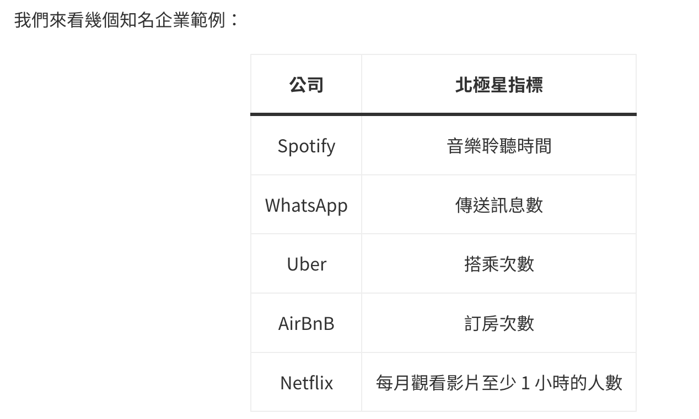
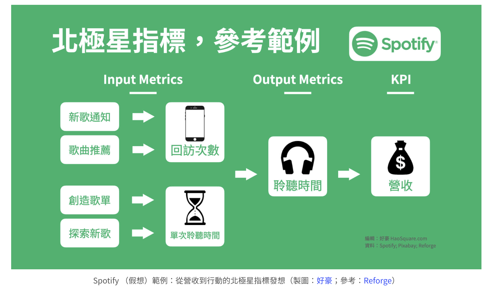
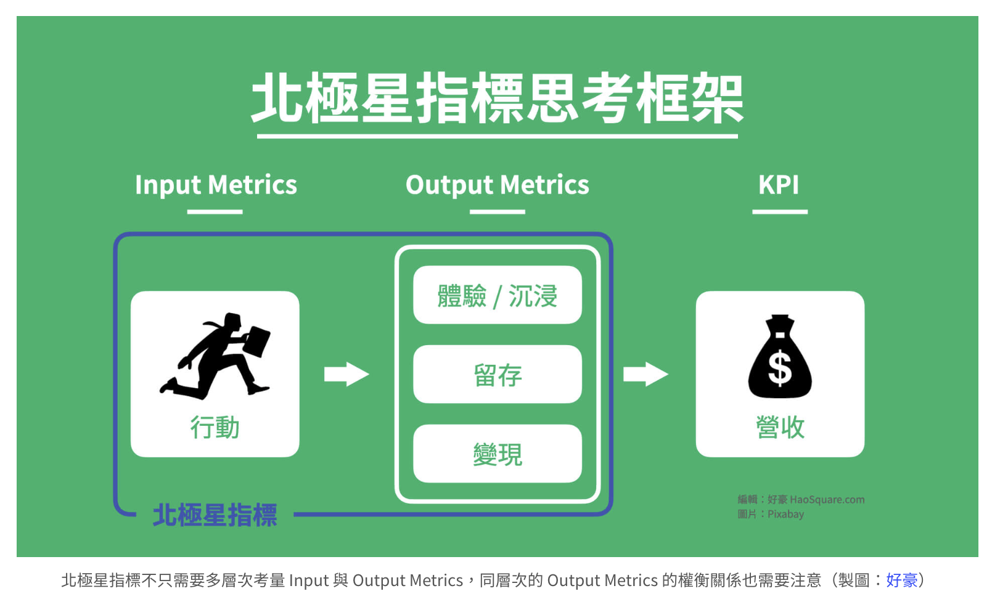

# 北极星指标

参考文献：https://haosquare.com/north-star-metric-framework/

北極星指標（North Star Metric）是對商業行為或系統的度量（Metric），這項度量需要可量化、並且要能反映出顧客體驗或滿意程度。

除了量化顧客滿意程度，好的北極星指標具有三大特質：
- 衡量客戶發現產品價值的時刻 (A-ha Moment)
- 表現目前產品的核心戰略，指引出確實可執行的任務
- 與未來營收相關的領先指標、而不是落後指標

## 1、框架式思考
北極星指標不是指單一個數字，而是把「賺錢」從口號化為行動的一套思考框架
北極星指標最重要的貢獻不是數字本身、而是在於「發想」，並且是發想出「對賺錢有幫助的行動」：
- 想辦法「賺錢」，定義太模糊、問題面向也太廣
- 想辦法讓顧客「滿意產品」，問題改為集中在提升產品滿意度的量化指標—也就是北極星指標

### 1.1 产品价值要关联收入
好的北極星指標，要衡量客戶發現產品價值的時刻（A-Ha Moment），並且，這個關鍵點需要對營收有直接貢獻

例如，Zynga 的拼字遊戲 “Words with Friends“，它的商業模式是在每個遊玩動作之間，安排插頁廣告。該團隊定義出的北極星指標是每個玩家「平均遊玩動作次數」：
- 反映價值：玩家遊玩動作越多、表示越投入遊戲
- 連結營收：每個人多走幾次、看到更多插頁廣告、收入提升

### 1.2 從輸出發想輸入
Output Metric 呈現出輸出結果，而 Input Metric 呈現的則是投入行動，通常北極星指標會是 Output Metric，你需要從預期的輸出結果發想並衍生出一系列需要投入的任務，來提升你的北極星指標

以籃球比賽來比喻，北極星指標的是計分板（Output Metric）、是比賽的階段性結果，至於比賽分數究竟該怎麼提升？需要取決於採用幾次快攻、或者決定出手幾次三分球等等戰略來作為輸入（Input Metric）

实践案例：Spotify

以 Spotify 音樂串流服務為北極星指標的（假想）範例，整理一下目前我們所學的框架式思考要點。

- potify 的產品特色與價值就是聽音樂，以每個用戶總聆聽時間作為北極星指標
- 總聆聽時間越多，代表客戶越滿意公司提供的服務，也就代表營收會提高
- 從輸出發想輸入：總聆聽時間 = 回訪次數 x 單次聆聽時間
  - 我們無法直接增加總聆聽時間，它是落後指標
  - 思考如何提升回訪次數與單次聆聽時間更能導引出實際行動
- Input Metrics 不斷延續出更具可執行性的項目
  - 為了增加 APP 回訪次數，發想出「新歌通知」功能

**簡單地說，對產品開發而言最重要的事情是「如何行動」（可執行性），北極星指標要不斷向下延伸、直到找出實際「該做什麼」為止，並且有必要同時觀測行動與結果各自的量化指標**

### 1.3 指標群與權衡
北極星指標常被過度極端地視為 OMTM (One Metric That Matters)，OMTM 指的是專注於單一量化指標的產品開發，好處是讓公司目標更一致、減少溝通成本，卻容易讓人誤解成只有一個指標是重要的,實際上，北極星指標應該是「指標群」（Constellation of Metrics），包含多個指標綜合考量
