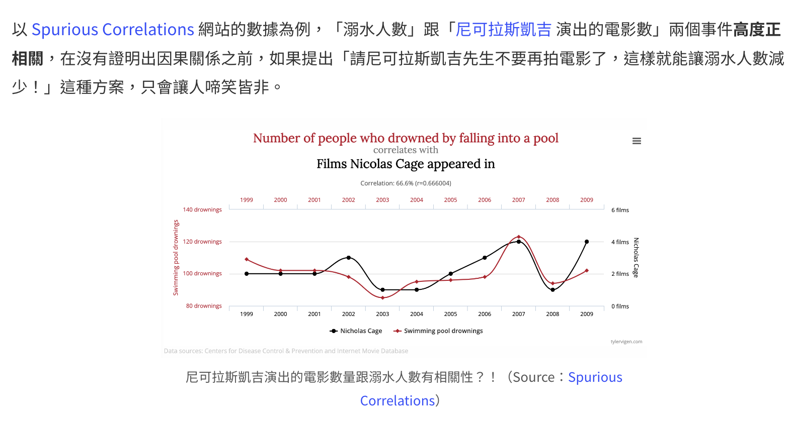
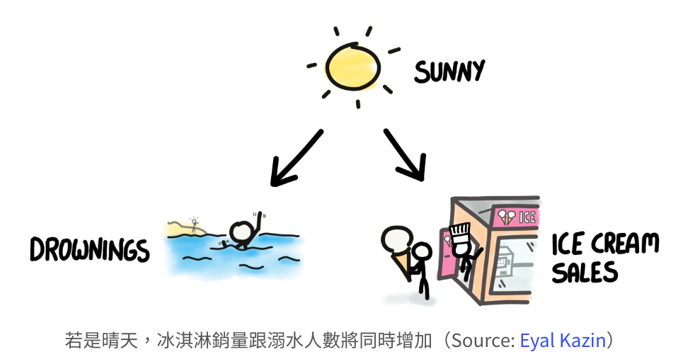

# 1、什么是因果推断？
A/B Testing 行不通時怎麼辦，去研究【种什么因】【得什么果】的科学

参考文献：https://haosquare.com/causal-inference-intro/

## 相关并不代表因果
统计模型本身只描述相关性，而不会描述因果关系

尼古拉斯凯奇的电影与溺水人数：

# 2、因果推断的困难点
## 混淆因子
混淆變項（Confounding Variable）指的是會同時影響兩個變項的變項，會使研究者錯誤理解有興趣的那兩個變項之間的關係。

例如，在某個海水浴場，觀測到「每日冰淇淋銷售量」跟「每日溺水人數」有高度正相關，這不代表越多人溺水、就造成越多人買冰淇淋站在一旁當吃瓜群眾。對這項數據相關性有更大影響力的是「是否為晴天」這項混淆變項：

若是晴天 -> 玩水的遊客較多 -> 冰淇淋銷量跟溺水人數同時都較多
若是雨天 -> 玩水的遊客較少 -> 冰淇淋銷量跟溺水人數同時都較少

又例如，某游戏新增许多新功能，但发现平均游戏时间变短 → 原因是：引入了大量新玩家，2分钟热度

## 自我选择偏差，Self-Selection Bias
當樣本中的每個人可以自由選擇自己是否要加入某個群體時，會產生的分析偏誤。

- 民调时，接电话回答“是否参与选举”比例虚高，原因是对政治不感兴趣的人会倾向直接挂掉电话
- 某APP红色背景上线后，使用红色的用户使用时长高很多，原因是本身老用户才回去探索

## 反事实
- 如果 2020 年沒有爆發 Covid-19 疫情，台灣 2020 年冬季的演唱會數量會是多少？
- 特斯拉的老闆馬斯克發個推特（Twitter）文章，虛擬貨幣 Dogecoin 價格馬上就暴漲；如果馬斯克沒有發表文章，此虛擬貨幣當日的價格應該是多少？
- 雙十一活動，網路拍賣網站給所有客戶免運費的優惠，但如果沒有這項優惠，訂單總數量會是多少？

反事實的概念可以很夢幻地稱為「平行世界」，我們永遠不知道在平行世界，要是我們在一模一樣的時空背景下做了另一個選擇，會有什麼不同的結果，這幾乎是無解的問題。然而，換個方向思考，從資料科學的角度來看，嘗試推測反事實可以看成一種缺失值填補（Missing Value Imputation），把在平行世界做了另一個選擇的自己視為缺失值。如果我們知道因果關係、知道每個選擇或行為造成多少「效果」，就可以用「效果」來預測出缺失值、衡量換個選擇的平行世界最後可能是什麼樣貌。

# 3、因果推断：AB-Test
A/B Testing 的核心之一是 隨機對照試驗（Randomized Controlled Trial，簡稱 RCT），將研究對象隨機分組，不同的組別給予不同的干預（或者說處理）。透過 RCT，可以消除混淆變項及自我選擇造成的偏誤，因為兩個組別受到混淆變項的影響會被平衡，兩組別除了干預有差別以外，其他的人口特性分佈（被假設）完全相同，例如 RCT 下，A 與 B 兩組別 65 歲以上人口的比例理論上會一模一樣。

**A/B Testing 可說是目前判斷因果關係最直覺好懂的做法，兩個組別限定只有一項干預的差別，其他不論是可觀測或不可觀測的變項，都因為隨機、視為兩組別相同，若是看到兩組別有差異，就可以確認是干預造成的影響**

## 并非一切都可以AB-Test
舉例而言，我們都知道雙十一舉辦折扣活動會讓營業額大幅提高，如果經營者想知道舉辦活動比起不辦活動營業額多了多少呢？這麼大的營收影響力，總不能做 A/B Testing 只讓一群人有折扣活動、而另一群人沒有吧！

**更重要的是*，发生在过去的事情没有办法复现，如果只有未经过实验设计的历史数据，该如何研究？**
因果推断：因果推斷是在一個較大系統內部確定指定現象（因）的實際、獨立效果（果）的過程

因果推論（Causal Inference）的科學方法被描述為分析干預效果的問題，干預（Intervention）或者處理（Treatment）就是因果推斷的「因」，研究者透過預測干預後的結果來了解「因」，回答出「如果我做了某事，會變成怎樣？」。

分解为【缺失值填補】问题，研究这个【因】带来的影响，就可以推测过去的结果

換句話說，如果沒有架構好因果推論的框架、或是做了錯誤的假設，就算懂再怎麼強大的機器學習模型，也無法正確衡量因果關係，這就是為什麼資料科學家們有必要了解因果推論方法、以避免錯誤解讀數據的脈絡。

# 4、因果推断的几种方法
## 4.1 實驗組與控制組的分配問題
当手里只有已经发生的、未经过实验设计的历史数据，可能由于混淆因子或者自选择偏差导致的不平衡

平衡人口特性分配：让比较趋于公平，Propensity Score Matching 與 Uplift Modeling 屬於此類方法
- 簡單地舉例，我們想知道在廣告 Email 中加入愛心符號能不能提升 Email 轉換成訂單的數量，然後發現點開有愛心符號 Email 的客戶中，明顯 40 歲以下年輕人比例高很多、大約佔 80%，那我們就刻意挑選一批同樣是年輕人佔比 80% 的樣本當作控制組，來跟受到干預的實驗組比較訂單數量差異，這就是人口特性更加平衡的意思。

所有人都受到干预：所有人都沒受到干預的平行世界，Synthetic Control 與 Difference-in-Difference 是這類方法的範例，透過預測反事實缺漏值的方式來建構平行世界
- 經營者會想知道有舉辦雙十一折扣、比起沒辦活動到底多賺了多少錢，而假設我們從 2009 年以前、雙十一活動還沒被發明的歷史資料中得知，百貨業 11 月的營業額通常會比 10 月多 30%，我們就把這個歷史經驗當作「平行世界」的參考依據，當我們實際在數據中看到今年 11 月營業額比 10 月多了 170%，研究者就可以比較兩個世界的差異，依此推論出雙十一折扣活動這個「因」的干預效果讓我們額外賺了 140% 的月營業額