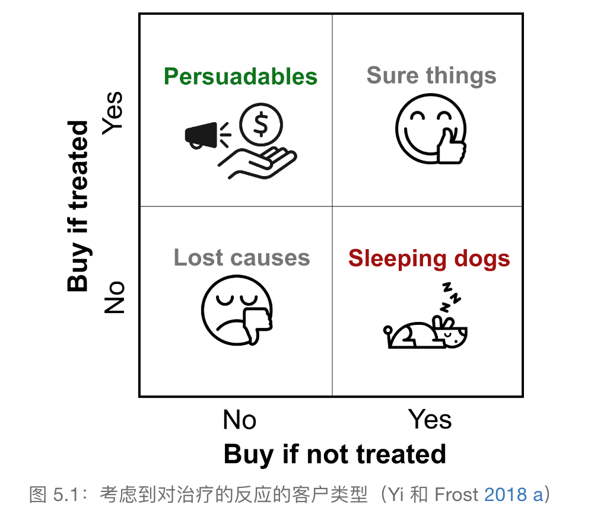
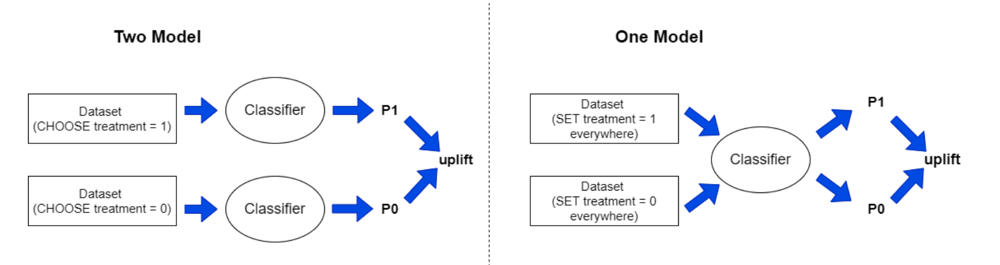
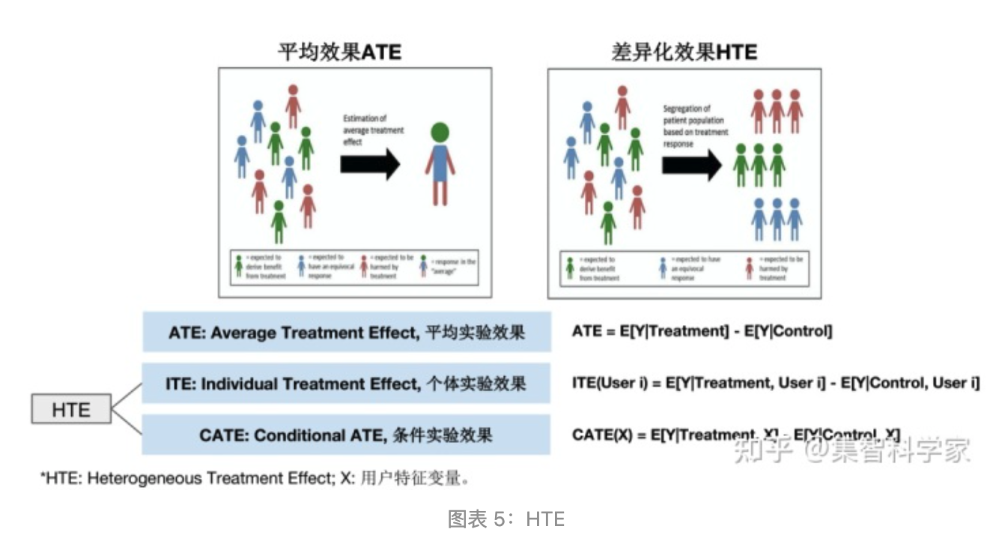
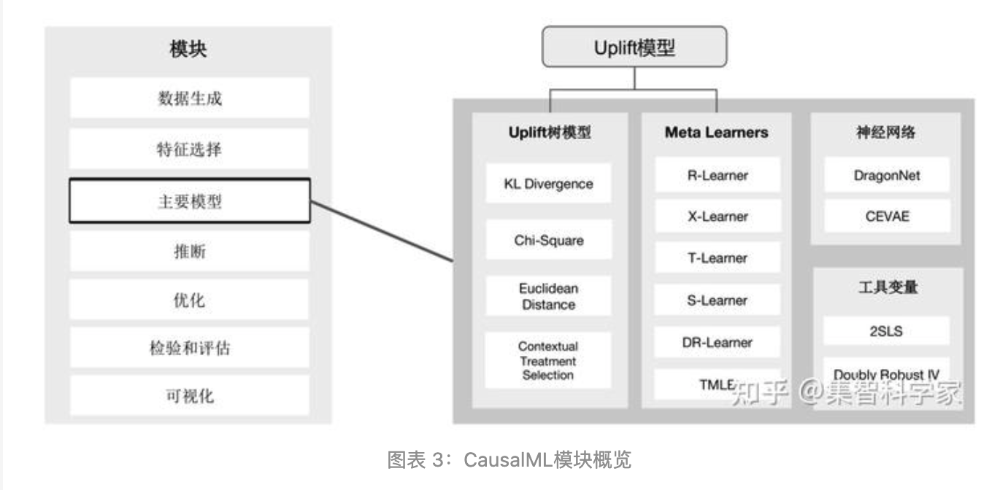
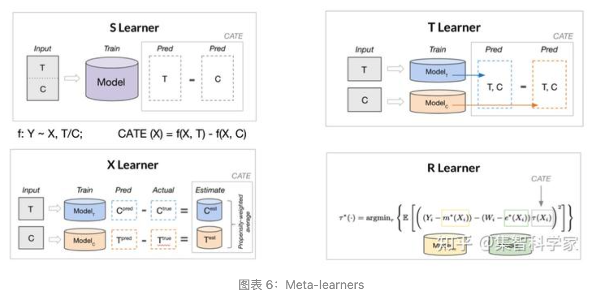
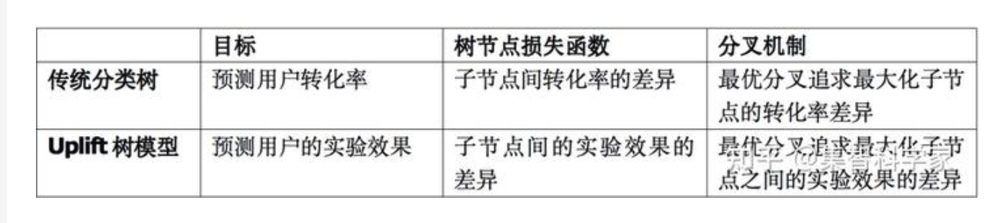

参考文献：https://www.modb.pro/db/601025

# 1、背景知识
开展大规模活动的成本很高，在决策时需要考虑哪种方式的ROI的最高，传统营销以响应模型为主，直接预测用户是否会进行相应

对于公司来讲，寻找persuadables和sleeping dogs更加的重要，前者投资会有收益，后者投资会带来损失，即寻找“营销敏感人群”

# 2、uplift modeling
Uplift Model，即增益预测模型，用于估算干预动作(treatment)对用户响应行为(outcome)产生的效果，即预测个体因果效应ITE
- 技术难点：但是，营销与不营销互为反事实观测结果，总有一个无法被观测。直接识别ITE是无法做到的
- 解决思路：因此，转向求解CATE = 整体中营销用户的响应率 - 整体中未被营销客户的响应率
- 前提假设：要求客户特征X和实验变量T互相独立，服从CIA假设，即 **实验组/对照组必须是随机分配的**，例如A/B实验中收集的数据可以作为样本

# 3、建模方法
- 传统相应模型：预测响应建模（常见的分类任务，模型为每个类别分配概率）
- uplift modeling（对增益进行建模），两种最常见的方法是：
* 两个模型
  * 构建2个分类器，分别对营销组和不营销组数据独立建响应模型，预测时用两个模型预测用户的分数就得到了uplift score；
* 单个模型
  * 在营销组和不营销组的用户特征中，加入与T（营销）有关的特征，合并数据，只训练一个响应模型；对同一客户通过将T=1和T=0时的分数相减得到了uplift score

# 4、评估指标
- 增益柱状图
  - 用模型对所有样本预测uplift值，按照uplift值倒序排序，分别计算每个十/百分位里的整体uplift（营销组响应率 - 非营销组的响应率），看是否有排序能力以及前几组是否有较高的uplift。
- 累计增益图
  - 基于上述计算的每个十分位的uplift值，可以计算出累积增益，第一个bar代表前10%的uplift，第二个bar代表前20%的uplift。一个表现好的模型在前半段会有比较大的值，后半段下降。可用于跨模型比较。
- 累计收益
  - 计算前t组uplift值乘以总人数，表示如果在前t个样本实施营销，获得的预期总收益（因果效应）。
- AUUC & GINI
  - 可以通过上述累计收益公式计算每一个 t 的增益效果，绘成曲线如下，可以得到 uplift model 最常用的评估指标AUUC（Area Under Uplift Curve），即曲线下的面积

# 5、CasualML: uber python package
允许用户根据实验或观察数据估计条件平均干预效果（Conditional Average Treatment Effect，CATE）或个体干预效果（Individual Treatment Effect，ITE）。本质上，它估计了在没有对模型形式进行有力假设的情况下，具有观察到的特征X的用户的干预T对结果Y的因果影响

整体上看，T对Y的影响 = 实验组Y - 对照组Y，这就是因果推断中的ATE（Average Treatment Effect)，但这种评估方式是整体评估，不能反应个体效果，因此引入了HTE (Heterogeneous Treatment Effect) 的概念，耦合ITE和CATE

因为ITE（该用户受到影响 - 该用户未受到影响）无法获得，所以一般用CATE来作为实际指标
ATT (Average Treatment Effects on Treated)：干预的人群的平均干预效应，干预的人群通过 PSM (Propensity Score Matching，倾向评分匹配) 等方法找出和他们一样的人作为替身，观察他们的效果差别

- 目标人群优化：在广告活动中，提高ROI的一个重要方法是将广告目标对准广告敏感人群，也即在给定KPI（如参与度或付费额）中获得良好响应的客户群。CATE通过从A/B实验或历史观察数据中估计个人层面广告暴露的KPI效果来识别这些客户。
- 用户个性化推荐：企业有多种与客户互动的方式，例如线上推送、短信触达等。可以使用CATE来估计每个客户的CATE和 ITE 组合，以获得最佳的个性化推荐系统。
- 观测数据的因果推断：平行时空的效果影响

目前支持方法：基于树的算法，元学习算法，工具变量算法，基于神经网络的算法

- meta-learner: 组合既有的传统机器学习模型。首先定义一个base learner，一般就是一个传统的机器学习模型，任何一个给定X可以预测Y的模型都可以。然后采用不同的混合方式，比如S Learner，T Learner，X Learner，R learner

- 树模型：Uplift树模型的基本想法是通过改变树模型的损失函数来估计CATE（见图7）。与传统分类树的区别如下：

# 4、总结
A/B测试基本覆盖了大多数实验场景；
网络效应实验适用于分流时用户之间存在干扰的情况，也即因果推断中的interference问题；
Uplift模型适用于对HTE的估计；
灰度放量试验适用于全量上线有风险，需要实时监控修正再逐步放开的情况；
MAB即多臂老虎机，适用于在多实验组中进行价值优化；
Interleaving基于同一个用户对于排序方法A和B的偏好，适用于评估排序算法对长尾查询的效果。