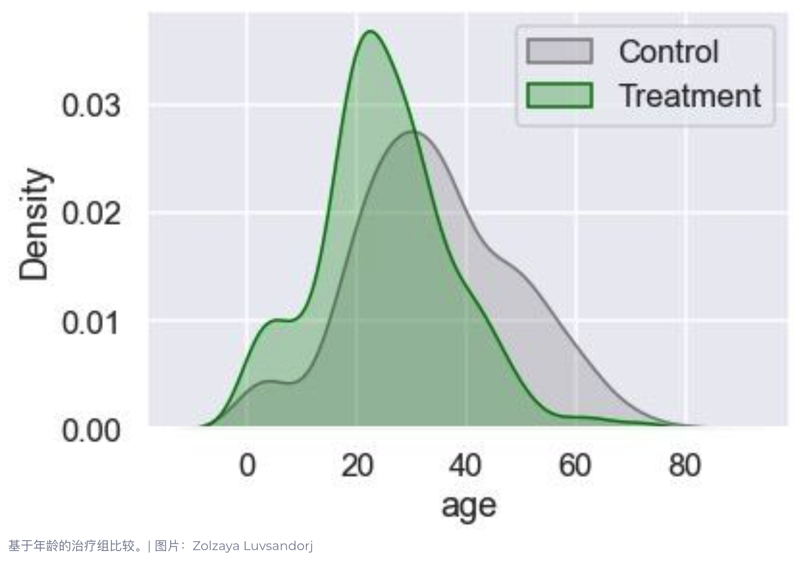
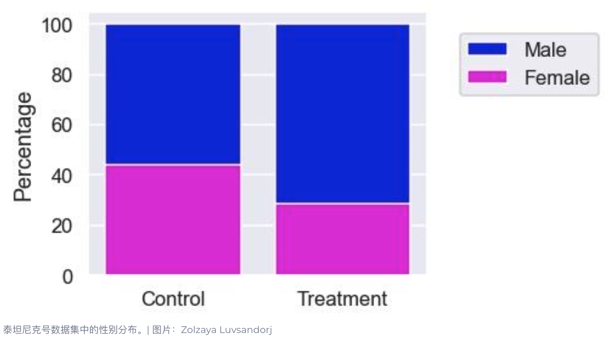
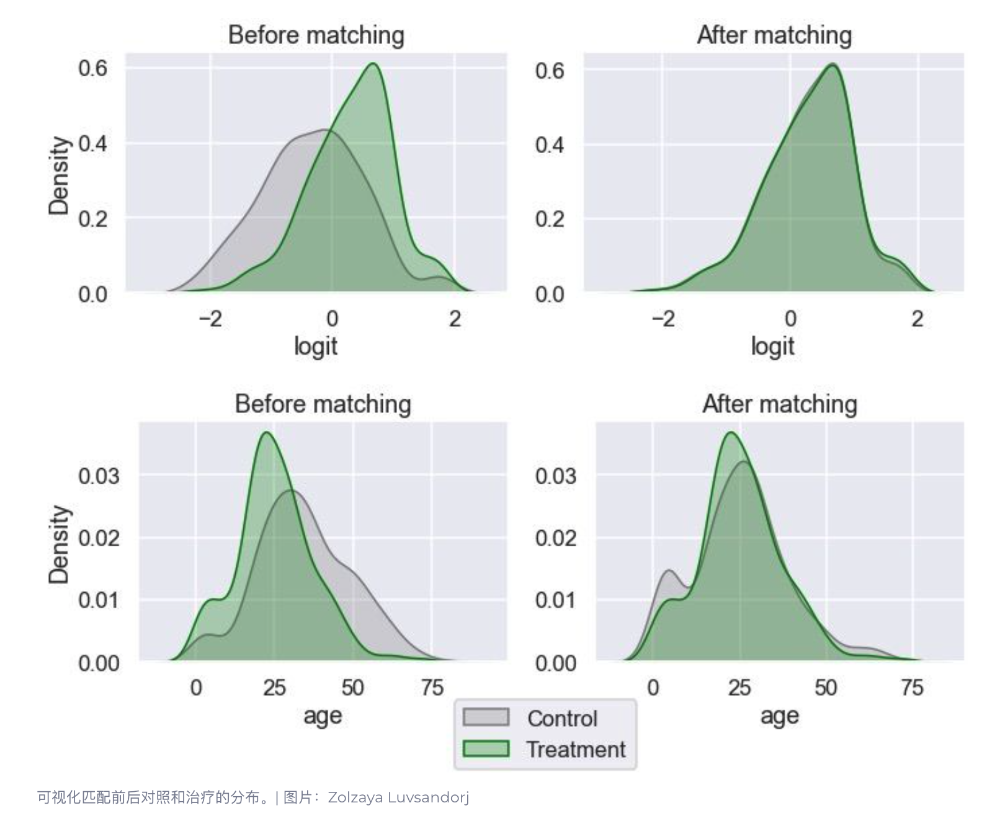
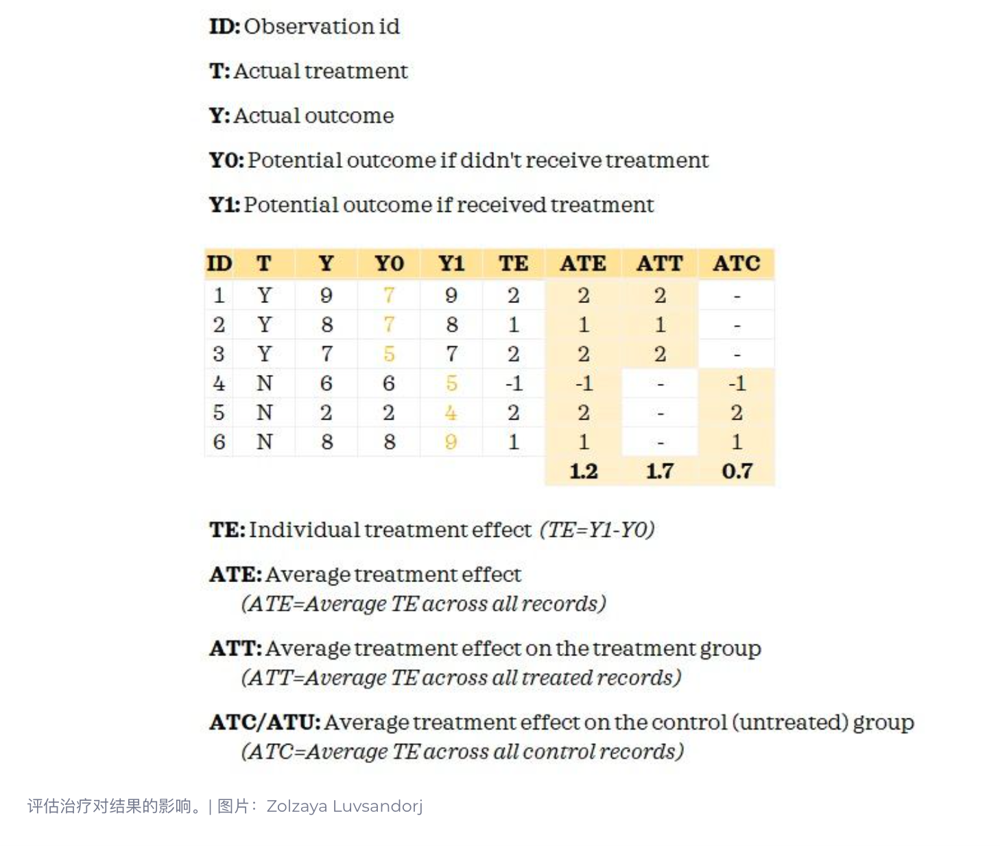

# PSM：Propensity Score Matching，倾向得分匹配

参考文献：https://builtin.com/data-science/propensity-score-matching

倾向评分匹配是一种非实验因果推理技术，试图平衡实验组的混杂因素，使它们具有可比性。这使得用户可以使用观察数据得出treatment对结果的因果影响的结论。

- 结果变量：我们想要了解treatment效果的感兴趣变量，这是效果。
- 治疗变量：我们想要了解其对结果变量的影响的感兴趣变量，这就是原因。
- 混杂变量：影响治疗选择和结果变量的变量。 在某些情况下，这也称为协变量。

## 与A/B Test的区别
在 AB 测试中，随机收集足够大的具有代表性的总体样本。然后，AB 测试的参与者被随机分配到不同的组：A 和 B。这种随机分配有助于将参与者分为相似的组，其中混杂因素是平衡的。当我们对一组进行treatment而不对另一组进行treatment时，各组之间的主要区别在于treatment。由于在没有treatment的情况下各组具有可比性，因此我们可以合理地说，各组之间结果的统计学显着差异是由treatment引起的

但是，任何未作为 AB 测试的一部分收集的数据都是观察数据。在观察数据中，treatment是由个体选择的，而不是随机分配给他们的。这意味着存在选择偏差，treatment不再独立于混杂因素。因此，即使在没有treatment的情况下，两组也没有可比性。当还有其他因素在起作用时，很难说各组之间结果的统计显着差异是由treatment引起的。

## PSM步骤
- 收集数据
  - 很关键，需要收集所有可能涉及的混淆因子
- 估计倾向性得分
- 匹配记录
- 评估匹配
- 评估treatment效果

## PSM实例
泰坦尼克数据集，https://www.kaggle.com/datasets/vinicius150987/titanic3
尝试评估三等舱乘客对生存率的影响

### （1）收集数据
**如果不确定该变量是否会影响，最好还是给加进来**
研究 是否三等舱位 对 存活 的影响，混淆因子是年龄和性别，直接观察存活率，发现三等舱存活率24%、其他舱位57%
但是年龄和性别分布不平衡，因此，不能直接下结论

### （2）估计倾向性得分
将混淆因子（年龄、性别）对（是否三等舱）进行建模，输出分类概率，概率即为得分

### （3）将记录进行匹配
**有时候也可以几种距离算法混着用，如对性别使用精确匹配**
合理假设得分相似时，其他条件比较接近，将实验组中每个个体去寻找对照组最接近得分的个体（可一个、可多个），将其设置为对照组个体

### （4）评估匹配质量
看分布是否更加接近，使用假设检验是没有意义的，因为匹配的目的在于消除bias，直观的感受即可

### （5）重新评估
**可以对结果进行t检验，看是否显著**
评价因子：
