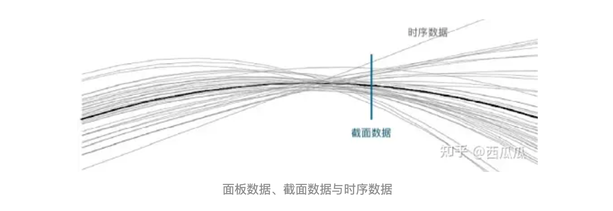
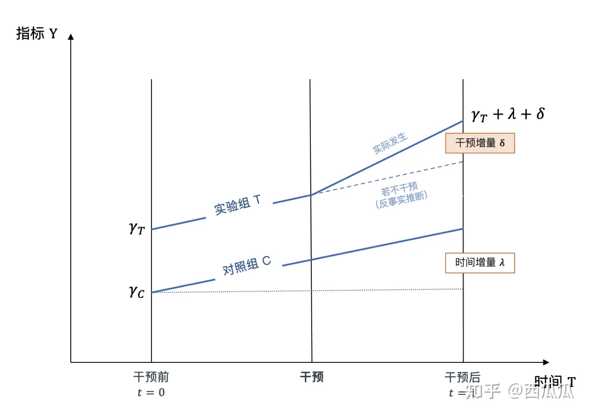
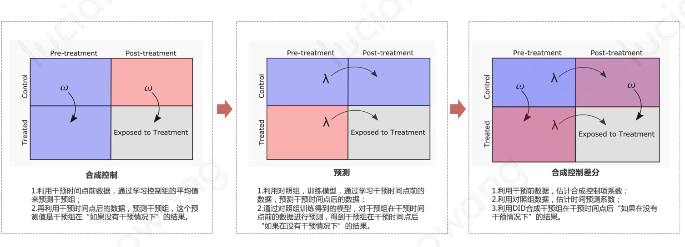

# 双重差分法（Difference-in-Difference）

因果效应涉及3个主题，群体因果效应估计-个体因果效应估计-因果关系的发现，DID是群体因果效应估计的重要方法，一般用于协助找到干预价值高的群体

面板数据：将时序数据和截面数据结合在一起使用
- 例：时序数据：用户A过去一年每天的购买情况，截面数据：20210510这一天所有用户的购买情况。

## 步骤
- 分组：对于一个自然实验，其将全部的样本数据分为两组：一组是受到干预影响，即实验组；另一组是没有受到同一干预影响，即对照组；
- 目标选定：选定一个需要观测的目标指标，如购买转化率、留存率，一般是希望提升的KPI；
- 第一次差分：分别对在干预前后进行两次差分（相减）得到两组差值，代表实验组与对照组在干预前后分别的相对关系；
- 第二次差分：对两组差值进行第二次差分，从而消除实验组与对照组原生的差异，最终得到干预带来的净效应

实际DID: 即实验组干预前后的均值的差减去对照组干预前后均值的差

## 使用时需要满足的假设
一般前2个会满足，第3个需要重点关注
（1）线性关系
该假设来自线性回归，认为因变量和结果存在线性关系，即：模拟未施加干预时的变化情况时，通常会进行线性回归
（2）个体处理稳定性假设
个体接受干预后不影响别的个体、个体接受干预后表现应该是唯一的
（3）平行趋势假设
实验组和对照组，在没有干预的情况下，所表现出的趋势应该是一致的。
- 通常是满足的，因为两批用户是近似且同质的，但有时可能会有意外，需要进行数据处理
  - PSM、三重差分法、合成控制法（Synthetic Control Method）

## 构建同质用户
1、PSM
工业界最常用的方法
2、三重差分法
DDD不太常用，引入变量太多，需要满足的假设也更多；再做一次双重差分，消除实验组和对照组差异带来的增量
如：假设给杭州地区的学生发红包，衡量红包影响，对照组是非学生，但是学生、非学生不同质，因此可以加入 宁波地区的学生和非学生，先做DID，识别学生和非学生之间的购买力差距，再拿杭州地区的DID-宁波地区的DID，结果就是杭州学生发红包的增益

## 分层二重差分 和 合成二重差分 模型
1、分层双重差分（Hierarchical Difference-In-Differences，HDID）将传统的双重差分方法扩展到处理多个干预组，通过独立估计每个干预组的效应，可以解决各个子群体间效应差异的问题（如低活、中活、高活分别进行DID）
2、合成双重差分（Synthetic Difference-In-Differences，SDID）通过合成控制（Synthetic Control）方法对传统的双重差分方法进行改进。
