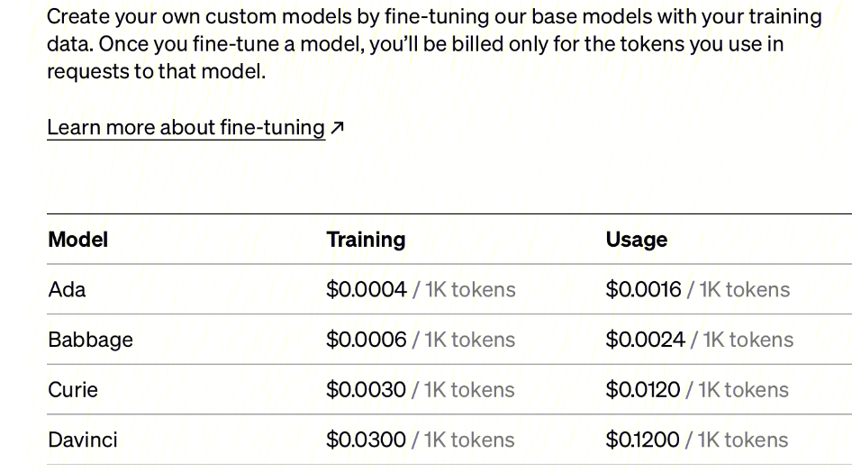

# OpenAI-Finetuning

参考文档：https://juejin.cn/post/7220411221043789885

微调通过训练比提示中更多的示例来改进小样本学习，从而在大量任务中取得更好的结果。对模型进行微调后，将不再需要在提示中提供示例，这样可以节省成本并实现更低延迟的请求。

- Prepare and upload training data 准备和上传训练数据

- Train a new fine-tuned model 训练新的微调模型

- Use your fine-tuned model 使用您的微调模型

Fine-tuing实例教程：https://cobusgreyling.medium.com/how-to-fine-tune-gpt-3-for-custom-intent-classification-95973d05d7e

超参：

- model: 要微调的基本模型的名称。可以选择“ada”、“babbage”、“curie”或“davinci”之一

- n_epochs: 默认为4，迭代次数

- batch_size: 默认为训练集中示例数量的 0.2%，上限为 256，数据集越大设置的越大

- learning_rate_multiplier: 默认为 0.05、0.1 或 0.2，具体取决于最终的 batch_size 。微调学习率是用于预训练的原始学习率乘以该乘数。建议使用 0.02 到 0.2 ，batch越大学习率设置越大

- compute_classification_metrics：分类指标，默认为 False


## 1.1 哪些模型可以用于微调？
微调目前仅适用于以下基本模型： davinci 、 curie 、 babbage 和 ada 。这些是训练后没有任何说明的原始模型（例如 text-davinci-003 ）。进而可以继续微调微调模型以添加其他数据，而无需从头开始。

每个微调工作都从一个默认为curie的基本模型开始。模型的选择会影响模型的性能和运行微调模型的成本，模型可以是以下之一： ada 、 babbage 、 curie 或 davinci


## 1.2 任务查询和使用小技巧

除了创建微调作业外，还可以列出现有作业、检索作业状态或取消作业

```
# List all created fine-tunes
openai api fine_tunes.list

# Retrieve the state of a fine-tune. The resulting object includes
# job status (which can be one of pending, running, succeeded, or failed)
# and other information
openai api fine_tunes.get -i <YOUR_FINE_TUNE_JOB_ID>

# Cancel a job
openai api fine_tunes.cancel -i <YOUR_FINE_TUNE_JOB_ID>

# Delete a job
openai api models.delete -i <FINE_TUNED_MODEL>

import openai
openai.Model.delete(FINE_TUNED_MODEL)
```

调用训练好的模型
```
import openai
openai.Completion.create(
    model=FINE_TUNED_MODEL,
    prompt=YOUR_PROMPT)
```

## 1.3 应该如何处理预训练数据
- 每个prompt都应以固定分隔符结尾，以在提示结束和完成开始时通知模型。通常效果很好的简单分隔符\n\n###\n\n 。分隔符不应出现在任何提示中的其他地方。

- 由于openai tokenization，每个completion都应该以空格开头，它用前面的空格标记大多数单词。

- 每次完成都应以固定的停止序列结束，以在完成结束时通知模型。停止序列可以是 \n 、 ### 或任何其他未出现在任何完成中的标记。

- 对于推理，您应该按照与创建训练数据集时相同的方式格式化提示，包括相同的分隔符。还指定相同的停止序列以正确截断完成。

## 1.4 分类任务 
对于分类问题，建议使用 ada，一旦经过微调，它的性能通常只会比功能更强大的模型差一点点，同时速度更快，成本更低。

### 1.4.1 分类任务数据处理小技巧
- 在prompt末尾使用分隔符，例如 \n\n###\n\n 。最终向您的模型发出请求时，请记住还要附加此分隔符。
- 选择映射到单个标记的类。在推理时，指定 max_tokens=1 ，因为只需要第一个标记进行分类。
```
import openai
openai.Completion.create(
    model=FINE_TUNED_MODEL,
    prompt=YOUR_PROMPT,
    max_token = 1)
```
- 确保 prompt + completion 不超过 2048 个标记，包括分隔符
- 目标是每个类别至少 ~100 个例子
- 要获得类日志概率，可以在使用模型时指定 logprobs=5，5是类别数目
- 对于大量类别的分类，建议将类别转化为数字，最多处理~500个类别（由于标记化，在数字前添加一个空格有时会对性能略有帮助）
### 1.4.2 分类任务评价指标
分类任务提供了在结果文件中生成其他特定于分类的指标的选项，例如准确性和加权 F1 分数
> 要启用此功能，请设置参数 --compute_classification_metrics 。此外，您必须提供一个验证文件，并为多类分类设置 classification_n_classes 参数，或为二元分类设置 classification_positive_class 参数

## 1.5 条件生成任务 
条件生成是需要在给定某种输入的情况下生成内容的问题。这包括释义、总结、实体提取、编写给定规范的产品描述、聊天机器人等
### 1.5.1 生成任务处理小技巧
- 在 prompt 末尾使用分隔符，例如 \n\n###\n\n 。最终向训练好的模型发出请求时，请记住还要附加此分隔符。
- 在 completion 结束时使用结束标记，例如 END
- 请记住在推理过程中将结束标记添加为停止序列，例如 stop=[" END"]
- 至少 ~500 个示例
- 确保提示+完成不超过 2048 个标记，包括分隔符
- 使用较低的learning rate和仅 1-2 个epochs往往更适合这些用例

## 1.6 其他小技巧
可以使用后缀参数将最多 40 个字符的后缀添加到经过微调的模型名称中
```
openai api fine_tunes.create -t test.jsonl -m ada --suffix "custom model name"
```

每个job完成后附上一个结果文件。当检索微调时以及查看微调中的事件时，将列出此结果文件 ID
```
openai api fine_tunes.results -i <YOUR_FINE_TUNE_JOB_ID>
```